# Sparse Elucidated Latent Diffusion Transformer for text guided image synthesis
This repository contains the implementation resources for a **1.2B** parameters Sparse Ellucidated Latent Diffusion Transformer Model, achieving state-of-the-art image generation results, achieving an FID of 12.7 in zero-shot generation on the COCO dataset, at a significantly reduced computational cost of **$1314**.
The model is trained for masked and unmasked denoising representation learning subject to text prompts/captions using **classifier free guidance (CFG)** to ensure that the generated image is adherent to the text prompt.


# Results:
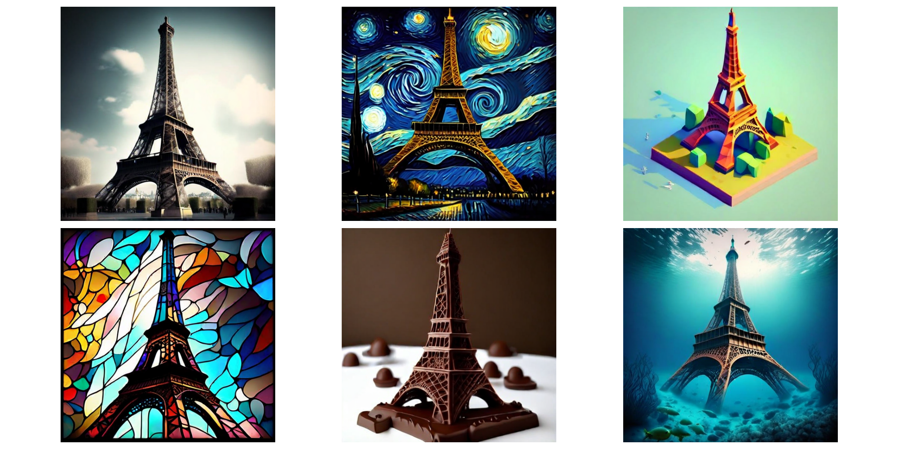
Prompts:
- *Eiffel tower; Eiffel tower in {} {Starry Night style by Vincent Van Gogh; Isometric low poly style; tainted glass style}*
- *Eiffel tower made of chocolate*
- *Eiffel tower under ocean*
--- 
Styles: *Pixel-art, cyberpunk, starry night*"
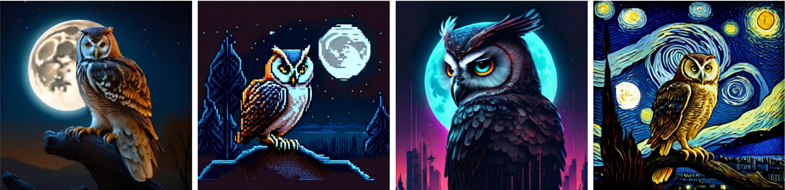
Prompt: *"Owl with moon as backdrop in _____ style"*
Styles: *Pixel-art, cyberpunk, starry night*"
---

Prompt: *"Moonlit night over a pond of lotuses and floating candles in drawn in the style of Starry Night by Vincent Van Gogh"*
---

Prompts: *"Venice canals painted like a Van Gogh night scene", "Scenic landscape in florence", "Venice canals in water color style"*
---
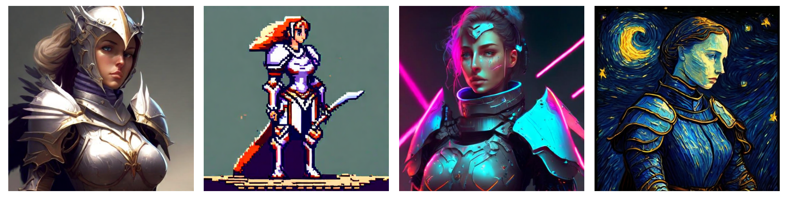
Prompt: *"concept art of a lady knight in ____ style"*
Styles: *Pixel-art, cyberpunk, starry night*"
---
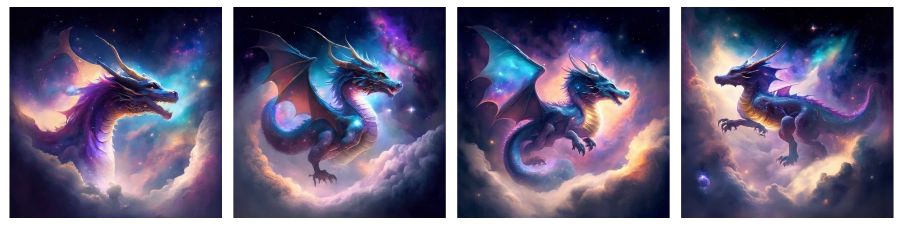
Prompt: *"A celestial dragon soaring through nebula clouds, sparkling with stardust"*
---
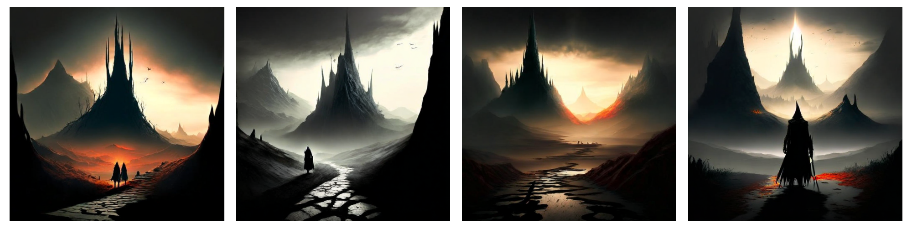
Prompt: *"In the land of mordor, where shadows lie"*
---

Prompt: *"A cosmic mage conjuring constellations in a swirling vortex of stars"*
---

---
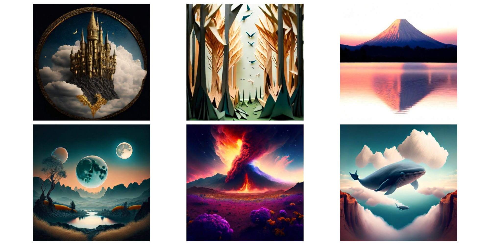
Prompts: 
- A gothic castle embroidered into the sky with golden thread
- A forest where all the trees are folded like paper cranes (origami forest)
- A thunderstorm trapped inside a crystal ball
- a samurai walking through snowfall, in Ukiyo-e woodblock style
- Mount Fuji at sunset with a mirror lake reflection
- Serene landscape with three moons
- Alien landscape, volcano explosion, field of flowers, galaxy nebulas in sky
- A whale flying through a canyon of clouds


# Table of contents:
- [Methodology](#methodology)
- [Diffusion Transformer Architecture](#Diffusion-Transformer-Architecture)


# Methodology:

## Implementation Details: Elucidated Diffusion Models (EDM)

This implementation is based on the "Elucidating the Design Space of Diffusion-Based Generative Models" (EDM) paper by Miika Aittala et al., which extends the Score-Based Generative Models (or Denoising Score Matching) framework formulated as Stochastic Differential Equations (SDEs) by Yang Song et al.

**Formulation of Diffusion Process as SDE:**

EDM models the diffusion process using an SDE, employing Langevin diffusion to refine the initial sample $x_T \sim \mathcal{N}(0, I)$ at each noise level $\sigma(t)$. This corrects for errors introduced during the initial sampling stage.
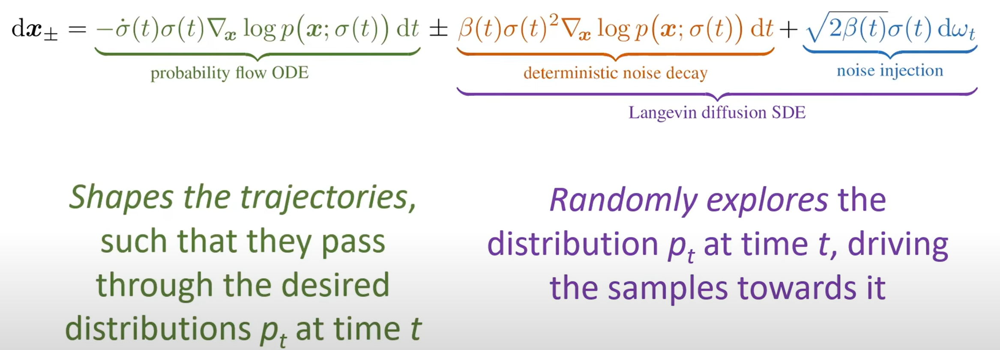
*Figure: SDE Formulation (Source: [Miika Aittala: Elucidating the Design Space of Diffusion-Based Generative Models](https://www.youtube.com/watch?v=T0Qxzf0eaio&t=2599s&ab_channel=FinnishCenterforArtificialIntelligenceFCAI))*


**Sampling:**
EDM models utilize a second-order Heun's-Euler solver to solve the SDE backwards for efficient and accurate sampling. 
The SDE uses score-function (log-gradient of true distribution) which can be computed using a denoiser, as explained in the work done by *Vincent Pascal* on *Denoising Score Matching*, the denoiser is approximated by the *Backbone Neural Network* in EDM models.
This repository provides implementation of deterministic sampler with option to introduce langevin dynamics for stochastic sampling.

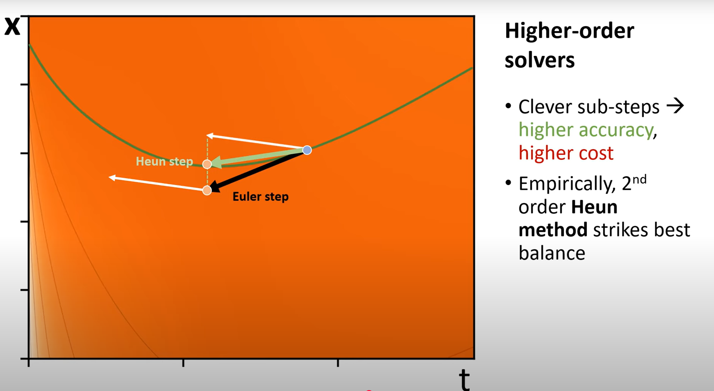
*Figure: Second order Heun's Solver for sampling (Source: [Miika Aittala: Elucidating the Design Space of Diffusion-Based Generative Models](https://www.youtube.com/watch?v=T0Qxzf0eaio&t=2599s&ab_channel=FinnishCenterforArtificialIntelligenceFCAI))*

EDM addresses the inefficiencies of uniform noise sampling in traditional diffusion models. Specifically:

* **Low Noise Levels:** At low noise levels, the transformation is approximately an identity transformation, leading to diminishing returns for the network predicting the negative score (noise). Uniform sampling of noise levels during training leads to redundant computation in this noise region.

* **High Noise Levels:** At high noise levels, the task devolves into approximating the original image from addition of two noisy signals, resulting in high variance and training instability.

To mitigate these issues, EDM employs a log-normal distribution for the noise schedule, $\sigma(t)$, centered around $\mu$ and $\sigma$. This focuses training on the intermediate noise levels where productive learning occurs, while still allowing the model to learn at extreme noise levels.
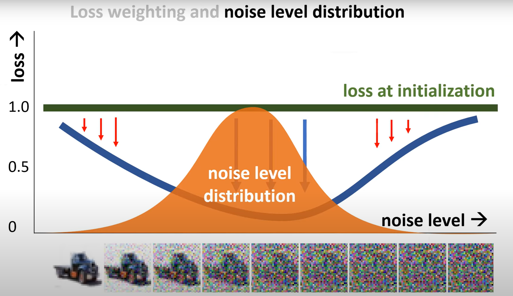
*Figure: Log-normal Noise level distribution during training (Source: [Miika Aittala: Elucidating the Design Space of Diffusion-Based Generative Models](https://www.youtube.com/watch?v=T0Qxzf0eaio&t=2599s&ab_channel=FinnishCenterforArtificialIntelligenceFCAI))*

Furthermore, EDM incorporates:

* **Loss Weighting:** Losses are weighted according to the noise schedule, optimizing training efficiency.
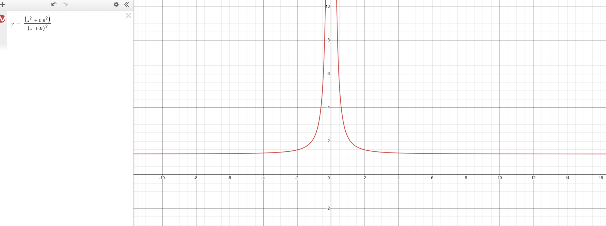
*Figure: Loss weigting at different noise levels during training*

* **Skip Connection Modulation:** The skip connection, used to predict the original image $x_0$ at low noise levels, is disabled at high noise levels. This reinforces the semantic distinction between noise prediction and direct image approximation while addressing the potential case of unstable training at high noise levels by proxy of high variance resulting from the model objective being formulated as MSE minimization between original $x_0$ and output of the model, which is simply addition of the appropriately scaled negative score predicted by the *Backbone Network* `c_out` * `negative_eps` and the input signal `x_t` to the backbone.
Thus the *Backbone Network* is encouraged to output straight approximation of $x_0$ by disabling the skip addition, to prevent the case of trying to predict $x_0$ as addition of two largely noisy signals (`c_out` * `negative_eps` + `x_t`).

* **Input Preconditioning:** Instead of scaling the ODE to preserve variance (which distorts probability flow), EDM normalizes the input signal via preconditioning, stabilizing deep network training.

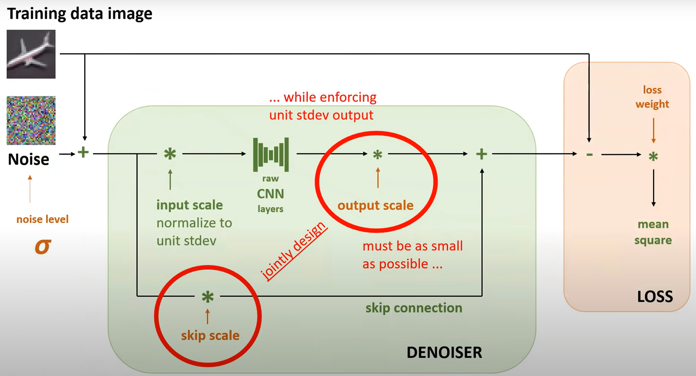
*Figure: EDM Training Structure (Source: [Miika Aittala: Elucidating the Design Space of Diffusion-Based Generative Models](https://www.youtube.com/watch?v=T0Qxzf0eaio&t=2599s&ab_channel=FinnishCenterforArtificialIntelligenceFCAI))*
*Note that this repository implements a sparse diffusion transformer to parametrize the denoiser to approximate the score function of true distribution* 


# Diffusion Transformer Architecture
Score based Generative models formulate the task of generating samples from distribution as iteratively denoising, or rather following the score function (log-gradient of true distribution), starting from a completely random sample from a Gaussian Distribution or a sample that still has some structure preserved that acts as a guiding factor for the iterative denoising process such as in stroke based generations using reverse diffusion for example.
As mentioned before the forward and reverse diffusion processes can be modelled with SDEs (Stochastic Differential Equations) with implicit Langevin exploration to rectify errors introduced in it intial sampling of the random noise $x_T$. The SDE formulation is reliant on the score function (log-gradient) of the true distribution, which can be evaluated using a denoiser, as explained in the work done by *Vincent Pascal* on *Denoising Score Matching*, the denoiser is approximated by the *Backbone Neural Network* in EDM models.

This repository implements the *Backbone Neural Network* as a *Diffusion Transformer Model*.

**Latent Diffusion for Efficiency:**
The cost for training transformers scales quadratically with input sequence length to the transformer model, and minimizing the training cost being the key highlight of this project, this repository resorts to implmenting Diffusion Model in the Latent Space of a Variational Autoencoder (VAE) `stabilityai/stable-diffusion-xl-base-1.0` with 8x compression ratio and 4 channels in the latent space, which effectively reduces the input sequence length to the transformer model by a factor of 8. 

**Patch Masking to reduce input sequence length during pretraining**
Input sequence length is further reduced by masking out 75% of the patches in the input to the DiT, while offsetting the loss of information from masking out 75% of the patches by prepending a lightweight *patchmixer transformer* to capture global context prior to applying masking to retain semantic information of the entire image and increase the effectiveness of the pretraining task to distill representation for masked denoising process. The loss objective exclusively consists of the patches that are visible to the DiT during training. The learned representation is further refined after pretraining stage by fine tuning with 0 masking ratio, so that the model is able to predict the score-function accurately during inference when no masking is involved. 

The repository provides a progressive pretraining‑finetuning pipeline, seamlessly scaling the model’s denoising capabilities across resolutions by dynamically adjusting positional embeddings, enabling effective masked and unmasked denoising representation learning.
The model is first pretrained with 75% patch masking then fintuned at 256x256 image resolution and then pretraining into fine tuning pipeline is reiterated on 512x512 images.

**Architecture Details:**
The repository implements a 1.2B parameters *Sparse Diffusion Transformer Model* to parametrize the score-function for iterative denoising of the VAE latents to generate a sample in latent space of VAE, which upon being decoded results into an image coherent to the text prompt. This implementation utilizes the `openclip:hf-hub:apple/DFN5B-CLIP-ViT-H-14-378` pretrained clip model for latent representation of text prompts.

The latent text prompt is processed with self attention layer then linearly projected to have the same channels as the DiT backbone.
The DiT architecture consists of a light weight *patchmixer transformer*, followed by *DiT Backbone transformer* which consist of 6 and 28 *DiT blocks* respectively.

Each *DiT block* consists of self-attention block that refines information flow during foward pass, cross-attention block that modulates the information flow by aggregating information from latent embeddings from the pretrained **OpenClip** model and a feed forward block that processes the information. Within each block, the intermediate activations of *Self-attention* and *Cross-attention* blocks are modulated by *scale, gate and shift* factors devised from current noise level $\sigma(t)$ modulated with *pooled* open-clip latent embeddings using *AdaLN* layer.

The model utilizes *Expert Choice Mixture of Experts blocks*, with 2:8 activation ratio, in alternative *DiT blocks* to increase the representation power of the network without significantly increasing the training cost.

The model utilizes sinusoidal embeddings for representing current noise level $\sigma(t)$ and encoding positional information.

## Installation:
Clone and install repository as follows:
```bash
    pip install .
```

## Datasets:  
The model was trained on JourneyDB, SA1B and DiffusionDB datasets, more info in [datasets](micro_diffusion/datasets/readme.md)

## Training:
The model can be trained with following command
```bash
composer train.py --config-path ./configs --config-name 256_pretrain.yaml exp_name=masked_pretrain model.train_mask_ratio=0.75
```
change configs and masking ratio in the specified command to Pretrain/finetune the model accordingly.
The model was trained in following order:
1. Pretrainig at 256x256 with 75% masking ratio
2. Finetuning at 256x256 with 0% masking ratio
3. Pretrainig at 512x512 with 75% masking ratio
4. Pretrainig at 512x512 with 0% masking ratio

These stages can be made to run sequentially by running,
```bash
bash execute.sh
```

## Acknowledgements:
The implementation of this Diffusion Model takes heavy inspiration from the paper [Elucidating the Design Space of Diffusion-Based Generative Models](https://arxiv.org/abs/2206.00364) and [Stretching Each Dollar: Diffusion Training from Scratch on a Micro-Budget](https://arxiv.org/abs/2407.15811)

Opensource sources referred:
Hydra Composer Framework, Diffusers Library, Streaming Dataloader


